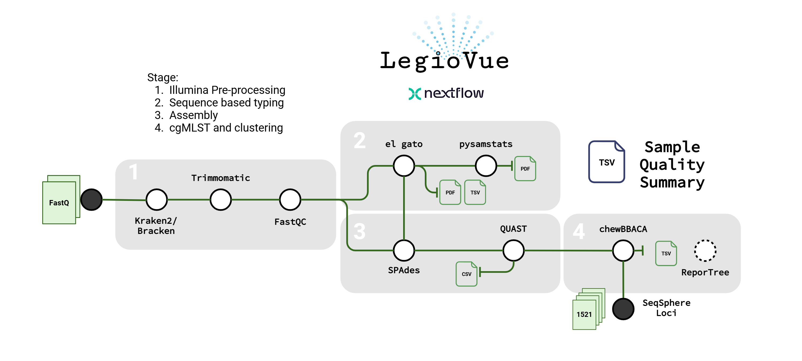

# legiovue
LegioVue is a nextflow pipeline for whole-genome analysis of *Legionella pneumophila*. It performs *in silico* sequence typing, genome assembly, and core-genome analysis. It also provides detailed information about the quality of *L. pneumophila* genomes. The name is an homage to the Bellevue-Stratford hotel, site of the first known outbreak of Legionnaire's Disease. 

This project serves as a repository for tools, notes, and informtation regarding the LegioVue pipeline. This project is a GRDI funded research project surrounding the **assessment and implementation of a whole genome sequencing scheme for rapid resolution of _Legionella pneumophila_ outbreaks within Canada to better protect vulnerable populations**. The goal is to generate and nationally deploy a standardized pipeline that will shift _L. pneumophila_ analysis from conventional sequence based typing to whole genome sequence-based typing and clustering, for rapid detection and response to Legionnaires' Disease outbreaks in Canada. 

## Big Picture Overview
**LegioVue** contains a combination of tools that are used to do *de novo* assembly, sequence typing, cgMLST, and quality control for all input samples with the end goal in having the available data to confirm cluster outbreaks. Currently, clustering is not included in the pipeline but its addition is to come soon. With this, there are additional available steps on how to use all of the outputs to do cluster analysis.

  
---

## Index
- [Installation](#installation)
- [Resource Requirements](#resources-requirements)
- [Quick Usage](#quick-usage)
- [Quick Outputs](#quick-outputs)
- [Pipeline Components and Settings](#pipeline-components-and-settings)
- [Limitations](#limitations)
- [Citations](#citations)
- [Contributing](#contributing)
- [Legal](#legal)

## Installation
Installation requires both [nextflow](https://www.nextflow.io/) and a dependency management system to run.

Steps:
1. Download and install nextflow
    1. Download and install with [conda](https://docs.conda.io/en/latest/miniconda.html)
        - Conda command: `conda create on nextflow -c conda-forge -c bioconda nextflow`
    2. Install with the instructions at https://www.nextflow.io/

2. Determine which dependency management system works best for you
    - *Note*: Currently `el_gato` and the plotting are using custom docker containers
        - `el_gato` will transition back to the proper one once a new release is made

3. Run the pipeline with one of the following profiles to handle dependencies (or use your [own profile](https://nf-co.re/docs/usage/getting_started/configuration) if you have one for your institution! The NML one is included as an example):
    - `conda`
    - `mamba`
    - `singularity`
    - `docker`

## Resources Requirements
By default, the `kraken2` and `SPAdes` steps have a minimum resource usage allocation set to `8 cpus` and `48GB memory` using the nf-core `process_high` label.

This can be adjusted (along with the other labels) by creating and passing a [custom configuration file](https://nf-co.re/docs/usage/getting_started/configuration) with `-c <config>` or by adjusting the `--max_cpus` and `--max_memory` parameters. More info can be found in the [usage doc](./docs/usage.md)

## Quick Usage
Detailed run and parameter instructions are found in the [usage doc here](./docs/usage.md).

To just get started and run the pipeline, the following basic command is all that is required:

```bash
nextflow run phac-nml/legiovue \
    -p <PROFILE> \
    --fastq_dir </PATH/TO/PAIRED_FASTQS> \
    [Optional Args]
```

Where: 
- `-p <PROFILE>`: The nextflow profile to use.
    - Specification of a dependency management system (docker, singularity, conda)
- `--fastq_dir </PATH/TO/PAIRED_FASTQS>`: Path to directory containing paired Illumina `_R1` and `_R2` fastq files
    - Fastqs must be formatted as `<NAME>_{R1,R2}\*.fastq\*`
    - At the moment everything before the first `_R1/_R2` is kept as the sample name

> [!NOTE]
> The default kraken2 standard database is hosted on AWS. In the event the connection is interrupted the pipeline will fail out. It is recommended to use/download a database from [the kraken2 database zone](https://benlangmead.github.io/aws-indexes/k2) and include `--kraken2 <PATH>` in the command above. The 8GB standard DB is the default.

## Quick Outputs
All of the outputs can be found in [the output docs](./docs/output.md). All outputs are by default put in the `results` folder with some of the major outputs being as follows:
- `spades/`: Contains the SPAdes assemblies (contigs as .fasta files) for each sample.
- `el_gato/el_gato_st.tsv`: Summarized el_gato ST calls for all samples.
- `chewbbaca/allele_calls/cgMLST/`: cgMLST profiles that can be used for downstream visualization.
- `overall.qc.tsv`: Final quality summary report for each sample throughout the different pipeline steps. Important quality flags can be found in this file.

## Pipeline Components and Settings

**`Kraken2`** and **`Bracken`**

[Kraken2](https://github.com/DerrickWood/kraken2) is used to taxonomically profile the paired Illumina reads against the standard Kraken RefSeq database with a confidence level of 0.1 (`--confidence 0.1`). [Bracken](https://github.com/jenniferlu717/Bracken) is then used to estimate taxonomic abundances (including potential contaminants) from the Kraken profile.  

**`Trimmomatic`**

[Trimmomatic](https://github.com/usadellab/Trimmomatic) is used to remove Illumina adapters (`ILLUMINACLIP:TruSeq3-PE.fa:2:30:10:2:True`) and trim reads according to quality (`LEADING:3`, `TRAILING:3`, `SLIDINGWINDOW:4:20`). Reads shorter than 100bp are dropped (`MINLEN:100`).  

**`FastQC`**

[FastQC](https://www.bioinformatics.babraham.ac.uk/projects/fastqc/) provides quality information about the trimmed reads including estimates of duplication, %GC, and N content. Samples retaining fewer than 150,000 high-quality read pairs after trimming are removed unless `--min_reads <COUNT>` is specified.  

**`SPAdes`** and **`QUAST`**

High-quality reads (both paired and unpaired) are then assembled into Legionella genomes using the [SPAdes](https://github.com/ablab/spades) assembler and `--careful` option, which aims to minimize mismatches and short indels in the assembly. The quality of the resulting assemblies is evaluated with [QUAST](https://github.com/ablab/quast). At this step, genomes are compared to a _Legionella pneumophila_ [reference genome](data/C9_S.reference.fna) and an assembly quality score is calculated for each sample using a custom script.  

The `quast_analyzer.py` script assigns a score to each SPAdes assembly based on pre-cgMLST metrics (_e.g.,_ similarity to RefSeq complete _Lp_ genomes, N50, # contigs, %GC content) originally outlined in the supplementary appendix (Supplementary Table 2) of the following paper:  
      
> Gorzynski, J., Wee, B., Llano, M., Alves, J., Cameron, R., McMenamin, J., et al. (2022). Epidemiological analysis of Legionnaires’ disease in Scotland: a genomic study. The Lancet Microbe 3, e835–e845. doi: 10.1016/S2666-5247(22)00231-2
      
Quality thresholds and score effects have been updated in this pipeline to better capture quality issues that are likely to affect the interpretation of the resulting cgMLST profile. Assemblies are assigned a quality score out of 6, where a score of 6/6 represents an "excellent" high-quality _Legionella pneumophila_ assembly.   
  
**`el_gato`**

[el_gato](https://github.com/appliedbinf/el_gato) performs _in silico_ Sequence-based Typing (SBT) of _Legionella pneumophila_ sequences based on the identification and comparison of 7 loci (_flaA, pilE, asd, mip, mompS, proA, neuA/neuAh_) against an allele database. In this pipeline SBT is first called on Illumina paired-end reads using a mapping/alignment approach that is recommended by the `el_gato` developers. If samples are not initially assigned a sequence type (ST = `MA?` or `MD-`), `el_gato` is run again on the assembled genome using an _in silico_ PCR-based approach. The resulting allele and ST calls are reported in `el_gato_st.tsv`.

_Note: if the ST results are inconclusive after both approaches have been tried, users are encouraged to review the `possible_mlsts.txt` intermediate output for that sample in the pipeline results folder under `el_gato/reads/`_
  
**`chewBBACA`**

Assembled _Legionella pneumophila_ genomes are passed to [chewBBACA](https://github.com/B-UMMI/chewBBACA), which performs Core Genome MultiLocus Sequence Typing (cgMLST) according to the published [Ridom SeqSphere](https://www.cgmlst.org/ncs/schema/Lpneumophila1410/locus/) 1521-loci cgMLST schema for _L. pneumophila_.

**cgMLST Visualization and Clustering**

**`PHYLOViZ`** and **`reporTree`**

_Note: Reportree requires an update before it can be properly incorporated into the nextflow pipeline. Users can run reportree on their pipeline output separately for now to produce the same visualizations._ 

Visualize cgMLST profiles alongside sample metadata using one of the following two methods:

i) Either drop the cgMLST profile (e.g., `cgMLST100.tsv`) directly into [PhyloViz](https://online2.phyloviz.net/index) and upload metadata for visualization, or,  
ii) Perform partitioning (clustering) with [ReporTree](https://github.com/insapathogenomics/ReporTree), which will generate outputs (MST and metadata) that can be visualized with the local version of [GrapeTree](https://achtman-lab.github.io/GrapeTree/MSTree_holder.html). 

Detailed instructions for clustering and visualization are provided [separately](docs/clustering.md).

**Quality Summary**

LegioVue outputs a summary of quality metrics and warnings for each step of the workflow in the `overall.qc.tsv` file

The final quality summary has two columns: `qc_status` and `qc_message` that can be used to quickly determine if a sample is good or may have an issue. The `qc_status` column will be any of the following statuses:
- Pass: The sample passes all checks!
- Warn: The sample was flagged for a specific warning
- Fail: The sample has failed out of the pipeline and may not be included in the final cgMLST profile.

The `qc_message` column contains the reason for the `qc_status` and includes:

| Message | Associated Status | Flag Reason |
| - | - | - |
| low_lpn_abundance | WARN | Low (< 75%) *L. pneumophila* abundance is not expected with isolate sequencing and may indicate contamination. |
| low_read_count | WARN | Low read count (< 300,000 reads default) has been shown to lead to poor, uninformative assemblies. |
| low_n50 | WARN | Low N50 scores (< 100,000) have been shown to negatively affect clustering outputs by inflating observed allele differences. |
| low_exact_allele_calls | WARN | Low chewBBACA exact allele calls (< 90%) indicate that there may be issues in the assembly, possibly affecting the cgMLST profile. |
| low_qc_score | WARN | Low QUAST-Analyzer QC score (< 4) indicates that there may be issues in the assembly, possibly affecting the cgMLST profile. |
| no_lpn_detected | FAIL | Very low (< 10% default) *L.pneumophila* abundance flags that the sample may not be *L.pneumophila* and sample is removed from the remainder of the pipeline |
| failing_read_count | FAIL | Post-trimming read count below failing threshold (< 150,000 reads default) has been shown to lead to poor, uninformative assemblies and sample is removed. |

## Limitations
This pipeline is intended to be run on *Legionella pneumophila* paired illumina isolate sequencing data. In the future Nanopore long-read sequencing data will also be supported.

## Citations
This pipeline uses code and infrastructure developed and maintained by the [nf-core](https://nf-co.re) community, reused here under the [MIT license](https://github.com/nf-core/tools/blob/master/LICENSE).

> The nf-core framework for community-curated bioinformatics pipelines.
>
> Philip Ewels, Alexander Peltzer, Sven Fillinger, Harshil Patel, Johannes Alneberg, Andreas Wilm, Maxime Ulysse Garcia, Paolo Di Tommaso & Sven Nahnsen.
>
> Nat Biotechnol. 2020 Feb 13. doi: 10.1038/s41587-020-0439-x.
> In addition, references of tools and data used in this pipeline are as follows:

Detailed citations for utilized tools are found in [CITATIONS.md](./CITATIONS.md)

## Contributing
Contributions are welcome through creating PRs or Issues

## Legal
Copyright 2024 Government of Canada

Licensed under the MIT License (the "License"); you may not use this work except in compliance with the License. You may obtain a copy of the License at:

https://opensource.org/license/mit/

Unless required by applicable law or agreed to in writing, software distributed under the License is distributed on an "AS IS" BASIS, WITHOUT WARRANTIES OR CONDITIONS OF ANY KIND, either express or implied. See the License for the specific language governing permissions and limitations under the License.
