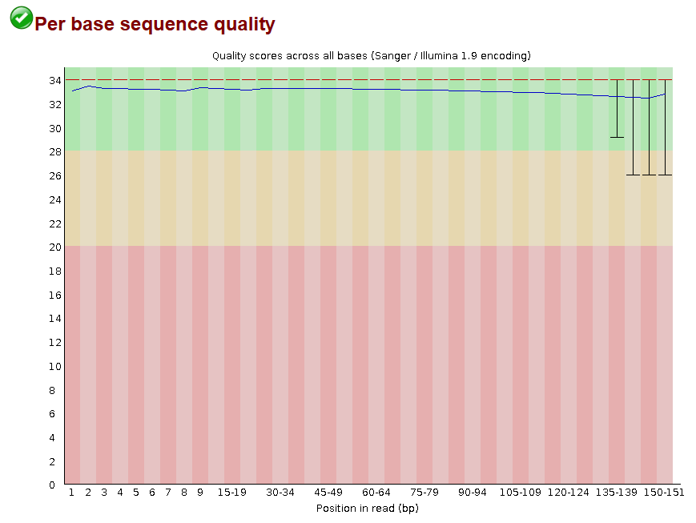
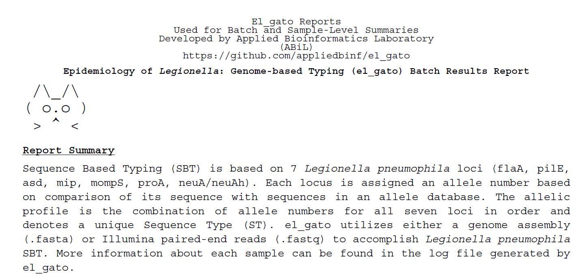
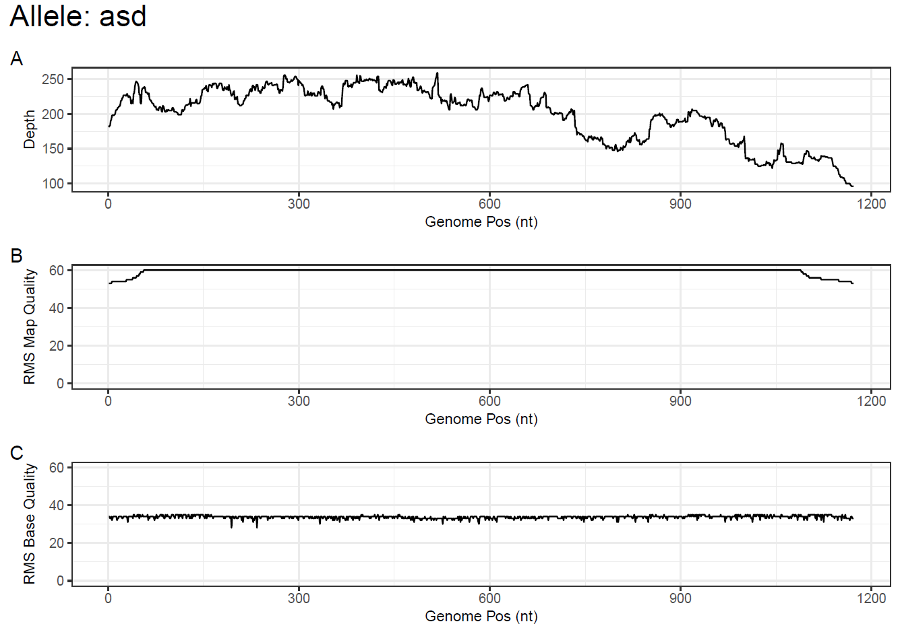

# phac-nml/LegioVue: Outputs

This document describes the output produced by the pipeline.

The directories listed below will be created in the results directory (by default) after the pipeline has finished. All paths are relative to the top-level results directory.

## Pipeline overview

The pipeline is built using [Nextflow](https://www.nextflow.io/) and processes data using the following steps:

- [Preprocessing](#preprocessing)
  - [Kraken2](#kraken2) - Taxonomic read classification
  - [Bracken](#bracken) - Species abundance estimation from kraken2 output
  - [Custom Abundance Check](#custom-abundance-check) - Filter samples with `< X%` _Legionella pneumophila_ reads
  - [Trimmomatic](#trimmomatic) - Trim and crop Illumina reads
  - [FastQC](#fastqc) - Trimmed read QC plots
- [Sequence Typing](#sequence-typing)
  - [el_gato Reads](#el_gato-reads) - Sequence type (ST) input sample reads
  - [el_gato Assembly](#el_gato-assembly) - Sequence type input sample assemblies when reads fail to generate an ST
  - [el_gato Report](#el_gato-report) - Create PDF summary el_gato report
  - [Pysamstats](#pysamstats) - Calculate positional depth, mapq, and baseq for each ST allele
  - [Allele Reports](#allele-reports) - Create per-sample ST allele report pdf
- [Assembly](#assembly)
  - [SPAdes](#spades) - _De novo_ bacterial genome assembly
  - [QUAST](#quast) - Assembly statistic report
- [cgMLST and Clustering](#cgmlst-and-clustering)
  - [chewBBACA](#chewbbaca) - cgMLST results
- [Final Quality Control](#final-quality-control)
  - [QUAST Scoring Script](#quast-scoring-script) - Simple assembly score of quast output based on established criteria
  - [Final QC Checks](#final-qc-checks) - Summary of pipeline QC metrics

Additionally [Pipeline information](#pipeline-information) which includes report metrics generated during the workflow execution can also be found

### Preprocessing

Initial processing steps and statistic gathering

#### Kraken2

Output files

- `kraken_bracken/`
  - `*-kreport.tsv`: Kraken2 taxonomic report
  - `*-classified.tsv`: Kraken2 standard output
  

[Kraken2](https://github.com/DerrickWood/kraken2/wiki/Manual#classification) classifies input sequences based on a taxonomic k-mer database where the input sequences are mapped to the lowest common ancestor of all genomes known to contain the given k-mer.

In the pipeline, kraken2 along with bracken are used to determine if there is any/enough _L.pneumophila_ data to run through the pipeline

#### Bracken

Output files

- `kraken_bracken/`
  - `*-abundances.tsv`: Bracken abundance report
  - `*-braken-breakdown.tsv`: Bracken taxonomic report that matches kraken2 report
  

[Bracken](https://github.com/jenniferlu717/Bracken/blob/v3.0/README.md) reestimates species abundance from kraken2 output.

In the pipeline, kraken2 along with bracken are used to determine if there is any/enough _L.pneumophila_ data to run through the pipeline

#### Custom Abundance Check

Simply python program that takes in the bracken abundance report and determines if a sample is above the given threshold required to keep in the pipeline (default 10.0%)

#### Trimmomatic

Output files

- `trimmomatic/`
  - `*_paired_R1.fastq.gz`: Paired trimmed read 1 to be used in the following pipeline steps
  - `*_paired_R2.fastq.gz`: Paired trimmed read 2 to be used in the following pipeline steps
  - `*_unpaired_R1.fastq.gz`: Unpaired trimmed reads 1 to assist in SPAdes assembly
  - `*_unpaired_R1.fastq.gz`: Unpaired trimmed reads 2 to assist in SPAdes assembly
  - `*.summary.txt`: Trimmomatic output summary
  

[Trimmomatic](http://www.usadellab.org/cms/uploads/supplementary/Trimmomatic/TrimmomaticManual_V0.32.pdf) removes Illumina adapters and trim reads according to quality

#### FastQC

Output files

- `fastqc/`
  - `*_fastqc.html`: FastQC per read quality summary report
  

[FastQC](https://www.bioinformatics.babraham.ac.uk/projects/fastqc/) gives general quality metrics and plots for the input reads.

---

### Sequence Typing

_In silico_ sequence typing and allele reporting using [el_gato](https://github.com/appliedbinf/el_gato)

#### el_gato Reads

Output files

- `el_gato/reads/`
  - `*_possible_mlsts.txt `: All possible allele calls and sequences types seen in reads
  - `*_reads.json`: Machine-readable summary for building [el_gato pdf report](#el_gato-report)
  - `*_reads_vs_all_ref_filt_sorted.bam `: Pileup of reads for each ST allele used for building [allele report](#allele-reports)
  - `*_run.log `: Program logging info
  - `*_ST.tsv`: Called Sequence Type
  

Sequence-based Typing (SBT) of _Legionella pneumophila_ sequences using reads based on the identification and comparison of 7 loci (_flaA, pilE, asd, mip, mompS, proA, neuA/neuAh_) against an allele database.

#### el_gato Assembly

Output files

- `el_gato/assemblies/`
  - `*_assembly.json`: Machine-readable summary for building [el_gato pdf report](#el_gato-report)
  - `*_run.log `: Program logging info
  - `*_ST.tsv`: Called Sequence Type
  

Sequence-based Typing (SBT) of _Legionella pneumophila_ sequences using output assemblies based on the identification and comparison of 7 loci (_flaA, pilE, asd, mip, mompS, proA, neuA/neuAh_) against an allele database. The assemblies are only run when there is an inconclusive ST call as this was found to sometimes recover the ST.

_Note: if the ST results are inconclusive after both approaches have been tried, users are encouraged to review the `possible_mlsts.txt` intermediate output for that sample in the pipeline results folder under `el_gato/reads/`_

#### el_gato Report

Output files

- `el_gato/`
  - `el_gato_report.pdf`: Final el_gato summary report including reads and assembly approaches
  

Tabular summaries of locus information for all samples run through [el_gato](https://github.com/appliedbinf/el_gato)

#### Pysamstats

Output files

- `el_gato/allele_stats/`
  - `*.allele_stats.tsv`: Per-sample summary of depth, map quality, and base quality
  

[Pysamstats](https://github.com/alimanfoo/pysamstats) combined output containing summary of depth, map quality, and base quality for each allele

#### Allele Reports

Output files

- `el_gato/plots/`
  - `*_allele_plots.pdf`: Per-sample plots of allele depth, map quality, and base quality
  

Custom report plotting of the seven ST alleles looking at depth, map quality, and base quality for each sample.

---

### Assembly

_De novo_ assembly and quality assessment

#### SPAdes

Output files

- `spades/`
  - `*.contigs.fa`: SPAdes assembly contigs.
  - `*.scaffolds.fa`: SPAdes scaffold assembly
  - `*.spades.log`: SPAdes logging information
  

[SPAdes](https://github.com/ablab/spades) is an _de novo_ de Bruijn graph-based assembly toolkit containing various assembly pipelines. In this pipeline we are using the `--careful` assembly flag to do the assembly and using the `contigs` to do subsequent analysis steps

#### QUAST

Output files

- `quast/`
  - `report.html`:
  - `transposed_report.tsv`:
  

[QUAST](https://github.com/ablab/quast) is used to generate a single report with which to evaluate the quality of the assemblies sequence across all of the samples provided to the pipeline. Input genomes are compared to a _Legionella pneumophila_ [reference genome](../data/C9_S.reference.fna) and the transposed report is parsed downstream to report a final quality score.

---

### cgMLST and Clustering

Core Genome MultiLocus Sequence Typing (cgMLST) using chewBACCA and the [Ridom SeqSphere](https://www.cgmlst.org/ncs/schema/Lpneumophila1410/locus/) 1521-loci cgMLST schema and how it can be used for follow-up clustering.

#### ChewBBACA

Output files

- `chewbbaca/allele_calls/`
  - `results_alleles.tsv`: Provides allele calling results including all allele classifications
  - `results_statistics.tsv`: Per-sample summary of classification type counts
  - `cgMLST/cgMLST.html`: Interactive line plot that displays number of loci in the cgMLST per threshold value (95/99,100)
  - `cgMLST/cgMLST###.tsv`: Allele calling results that masks all non-integer classifications that can be used for downstream visualization
  

[ChewBBACA](https://chewbbaca.readthedocs.io/en/latest/index.html) cgMLST according to the published [Ridom SeqSphere](https://www.cgmlst.org/ncs/schema/Lpneumophila1410/locus/) 1521-loci cgMLST schema for _L. pneumophila_.

The cgMLST allele calling results can be used downstream for clustering and visualization along with the STs.

---

### Final Quality Control

Finally summary scoring and metrics

#### QUAST Scoring Script

Output files

- `scored_quast_report.csv`: Scored quast report based on determined thresholds

Scored quast report based on adapted thresholds from [Gorzynski et al.](<10.1016/S2666-5247(22)00231-2>) to determine if the sample has any metrics that significantly deviate from the expected results

#### Final QC Checks

Output files

- `overall.qc.tsv`: Final collated overall summary report

The final collated summary report that is created using the outputs from the other pipeline steps and checks some final quality criteria.

The `qc_status` column will be any of the following statuses:

- Pass: The sample passes all checks!
- Warn: The sample was flagged for a specific warning
- Fail: The sample has failed out of the pipeline

The `qc_message` column contains the reason for the `qc_status` and includes:

| Message                | Associated Status | Flag Reason                                                                                                                                    |
| ---------------------- | ----------------- | ---------------------------------------------------------------------------------------------------------------------------------------------- |
| low_lpn_abundance      | WARN              | Low (< 75% abundance) _L.pneumophila_ abundance is not expected with isolate sequencing and may signify a problem sample                       |
| low_read_count         | WARN              | Low read count (< 300,000 reads default) has been shown to lead to poor, uninformative assemblies and sample is kicked out                     |
| low_n50                | WARN              | Low N50 (< 100,000) scores have been shown to very negatively affect clustering outputs                                                        |
| low_exact_allele_calls | WARN              | Low chewBBACA exact allele calls (< 90% called) show that there may be issues in the assembly                                                  |
| low_qc_score           | WARN              | Low QUAST-Analyzer QC score (< 4) shows that there may be issues in the assembly                                                               |
| no_lpn_detected        | FAIL              | Very little (< 10% default) _L.pneumophila_ abundance flags that the sample may not be _L.pneumophila_ and sample is kicked from pipeline      |
| failing_read_count     | FAIL              | Read count below failing threshold (< 150,000 reads default) has been shown to lead to poor, uninformative assemblies and sample is kicked out |

---
